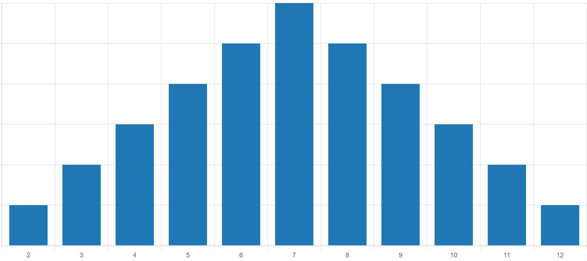

# Catan: Cities and Knights Game Simulation
**"Settlers of Catan: Cities and Knights"** is an expansion of the classic strategy board game.
This project includes game state management and balanced dice for a better experience.

---

## Features
The game simulation is part of my full stack web application. This includes data persistence in a database and all the logic
being handled by the backend server.
The included features of this application are listed here.

### Balanced Dice
The main reason for the game simulation was the idea of fairer dice rolls.
**"Catan"** heavily relies on the outcome of dice rolls. This can be frustrating, 
since the roll of dice follows a clear probability distribution, which is not always
realized in practice.

One would expect for the 7 to occur more often than the 2 when two dice are rolled together. 
The dice balancing is used to make the dice rolls follow the distribution more closely, so the game is less luck based.

To prevent this, each dice can be used in two modes:
- "Random" mode: Behaves like normal dice in the game of Catan. A pseudo-random number between 1 and 6
is assigned to each dice. This can result in a large deviation from the probability distribution.

- "Balanced" mode: Behaves like a card deck of numbers. The card deck includes 36 cards, where each dice sum is included
a different amount of times. So the card 7 is included 6 times, 6 is included 5 times, and so on.
To not make the dice rolls completely deterministic, a reshuffle threshold can be configured. With a reshuffle threshold
of 5, the last 5 cards are not used as dice rolls, and the card deck is reshuffled.

### Game State Management
Each game state includes all relevant game data like all dice rolls, ship position and player turn. The game state for each
game is saved in a session on the backend server.

After the game is finished, it can be saved to the database, where the game state is saved as well. This allows for
easy data analysis in the future.

## Implementation
The implementation of the mentioned features is very straightforward. The backend logic
can be found in the Web Application project, in src/main/java/net.zorphy.backend.catan